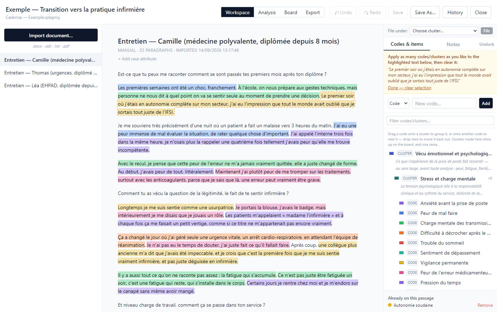
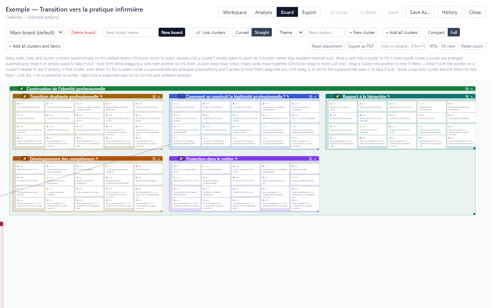
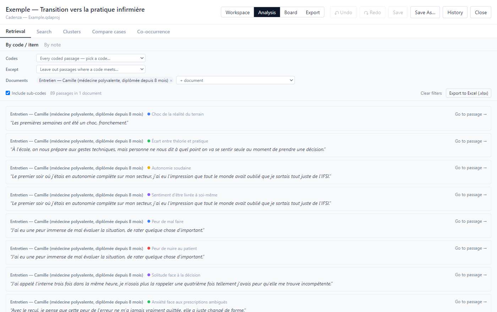
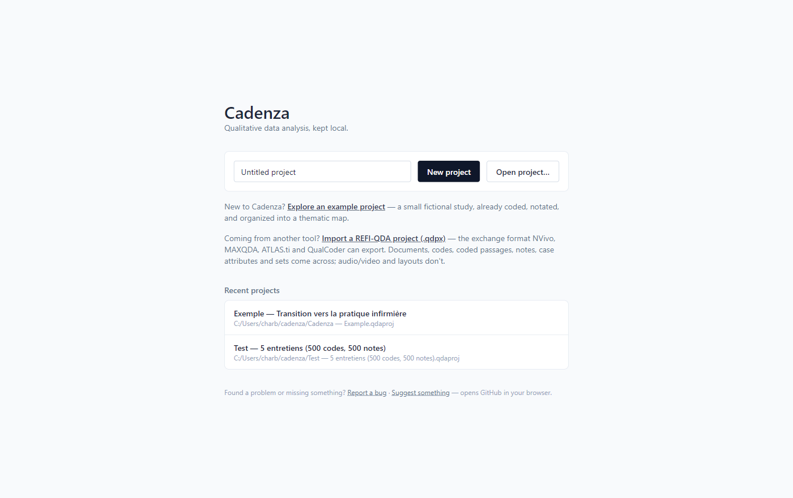

# Cadenza

A free qualitative data analysis (QDA) desktop app for Windows, macOS and Linux. It runs locally,
for a single user: no account, no server, your projects stay on your computer.

*Une application gratuite d'analyse qualitative (QDA) pour Windows, macOS et Linux. Elle
fonctionne en local, pour une personne : pas de compte, pas de serveur, vos projets restent sur
votre ordinateur.*

**[⬇ Download Cadenza / Télécharger Cadenza](https://github.com/seelebrn/cadenza/releases/latest)** · [Install guide (English)](#install-cadenza) · [Guide d'installation (français)](#installer-cadenza) · [Guide de démarrage (diaporama, français)](docs/Cadenza-guide-de-demarrage.pptx)

> [!IMPORTANT]
> **A security warning at first launch is expected.** Windows says *"Windows protected your PC"*:
> click **More info**, then **Run anyway**. macOS says *"Apple could not verify 'Cadenza'…"*:
> open **System Settings → Privacy & Security** and click **Open Anyway**. It appears once, and
> only because Cadenza, a free project, has no paid signing certificate.
> [Details](#the-security-warning-at-first-launch).
>
> **Un avertissement de sécurité au premier lancement est normal.** Windows affiche *« Windows a
> protégé votre ordinateur »* : cliquez sur **Informations complémentaires**, puis sur
> **Exécuter quand même**. macOS affiche *« Apple n'a pas pu vérifier que "Cadenza"… »* : ouvrez
> **Réglages Système → Confidentialité et sécurité** et cliquez sur **Ouvrir quand même**. Il
> n'apparaît qu'une fois, et seulement parce que Cadenza, projet gratuit, n'a pas de certificat
> de signature payant. [Détails](#lavertissement-de-sécurité-au-premier-lancement).

## Install Cadenza

You don't need a GitHub account, and there is nothing to build or configure. You download one
file and open it. It takes about two minutes.

### The security warning at first launch

Read this first, so it doesn't stop you at step 4. The first time you open Cadenza, your
computer shows a warning and seems to refuse to open it:

| | What you see | What to do |
|---|---|---|
| **Windows** | A blue window: *"Windows protected your PC"*, with only a **Don't run** button | Click the small **More info** link in the text, then the **Run anyway** button that appears |
| **Mac** | *"Apple could not verify 'Cadenza' is free of malware that may harm your Mac"*, with **Done** and **Move to Trash** | Click **Done** (not *Move to Trash*). Open **System Settings → Privacy & Security**, scroll down to the line about Cadenza, click **Open Anyway**, then confirm |
| **Linux** | Usually nothing | — |

**Why it appears.** Windows and macOS warn about any app whose author has not paid Apple or
Microsoft for a signing certificate, which Cadenza, as a free project, has not. It does not
mean something was detected in the file. The warning appears only the first time, and other
free research tools (QualCoder, for instance) show the same one. Cadenza's source code is
public in this repository. If you downloaded the file from this page, it is safe to continue.

### Step by step

**1. Open the download page.** Go to the **[latest release](https://github.com/seelebrn/cadenza/releases/latest)**. GitHub is the website
where Cadenza is published; a "release" is simply a version of the app.

**2. Find the list of files.** Scroll down past the list of changes to the section called
**Assets** (click the word *Assets* if the list is folded). You will see about ten files. You
need only one of them, and you can ignore everything else (`.blockmap`, `.yml`,
*Source code*).

**3. Download the file for your computer** by clicking its name:

| Your computer | File to click | Size |
|---|---|---|
| **Windows** 10 or 11 | `Cadenza-Setup-0.8.1.exe` | about 90 MB |
| **Mac** with an Apple chip (M1, M2, M3, M4) | `Cadenza-0.8.1-arm64.dmg` | about 110 MB |
| **Linux** | `Cadenza-0.8.1.AppImage` | about 130 MB |

The number in the name (0.8.1 here) is the version; yours may be higher. Your browser saves the
file in your **Downloads** folder.

- *Not sure which Mac you have?* Apple menu → **About This Mac**. If the line says **Chip:
  Apple M…**, the file above is the right one. If it says **Processor: Intel**, Cadenza has no
  build for that Mac yet.
- *On Windows, can't or don't want to install?* Take `Cadenza-0.8.1.exe` (without "Setup")
  instead. It is the same app in portable form: it runs when you double-click it, with nothing
  installed, and can live on a USB stick.

**4. Install it.**

- **Windows** — double-click the downloaded file. At the blue *"Windows protected your PC"*
  window, click **More info**, then **Run anyway** ([see above](#the-security-warning-at-first-launch)).
  The installer then does its work, and Cadenza appears in the Start menu and on the desktop.
- **Mac** — double-click the `.dmg` file, then drag the Cadenza icon onto the *Applications*
  folder shown next to it. Open Cadenza from Applications. At the *"Apple could not verify…"*
  message, click **Done**, then **System Settings → Privacy & Security → Open Anyway**
  ([see above](#the-security-warning-at-first-launch)). On older versions of macOS, right-click
  the app → **Open** → **Open** instead.
- **Linux** — right-click the file → **Properties** → **Permissions** → allow it to run as a
  program (or `chmod +x Cadenza-*.AppImage` in a terminal), then double-click it.

**5. First steps.** On the home screen, click **Explore an example project**: Cadenza asks
where to save a copy, then opens a small fictional study, already coded, that you can change
freely. To start your own work, type a name and click **New project**, then **Import
document…**.

**Good to know**

- **Your work is a single file** ending in `.qdaproj`, saved wherever you choose (Documents,
  for example). Back it up or copy it like any other file. Cadenza also keeps automatic earlier
  versions, under **History**.
- **Nothing is sent anywhere.** Cadenza works without an internet connection.
- **Updating** — Cadenza does not update by itself. To get a newer version, download it from
  the same page and install it over the old one. Your projects are not touched.
- **Uninstalling** — Windows: *Settings → Apps → Installed apps → Cadenza → Uninstall*. Mac:
  drag Cadenza from Applications to the Trash. Linux: delete the AppImage file. Your
  `.qdaproj` files stay where you saved them.
- **Something doesn't work?** Use **Report a bug** at the bottom of Cadenza's home screen, or
  [open an issue](https://github.com/seelebrn/cadenza/issues/new/choose) (that one does need a
  free GitHub account).

## Installer Cadenza

Pas besoin de compte GitHub, rien à compiler ni à configurer : vous téléchargez un fichier et
vous l'ouvrez. Comptez deux minutes.

### L'avertissement de sécurité au premier lancement

À lire d'abord, pour ne pas rester bloqué à l'étape 4. La première fois que vous ouvrez
Cadenza, votre ordinateur affiche un avertissement et semble refuser de l'ouvrir :

| | Ce que vous voyez | Ce qu'il faut faire |
|---|---|---|
| **Windows** | Une fenêtre bleue : *« Windows a protégé votre ordinateur »*, avec un seul bouton **Ne pas exécuter** | Cliquez sur le petit lien **Informations complémentaires** dans le texte, puis sur le bouton **Exécuter quand même** qui apparaît |
| **Mac** | *« Apple n'a pas pu vérifier que "Cadenza" ne contenait pas de logiciel malveillant »*, avec **Terminé** et **Placer dans la corbeille** | Cliquez sur **Terminé** (pas sur *Placer dans la corbeille*). Ouvrez **Réglages Système → Confidentialité et sécurité**, descendez jusqu'à la ligne qui concerne Cadenza, cliquez sur **Ouvrir quand même**, puis confirmez |
| **Linux** | En général, rien | — |

**Pourquoi il apparaît.** Windows et macOS avertissent pour toute application dont l'auteur
n'a pas payé de certificat de signature à Apple ou à Microsoft, ce qui est le cas de Cadenza,
projet gratuit. Cela ne signifie pas que quelque chose a été détecté dans le fichier.
L'avertissement n'apparaît que la première fois, et d'autres outils de recherche gratuits
(QualCoder, par exemple) affichent le même. Le code source de Cadenza est public, dans ce
dépôt. Si vous avez téléchargé le fichier depuis cette page, vous pouvez continuer sans crainte.

### Pas à pas

**1. Ouvrez la page de téléchargement.** Allez sur la **[dernière version](https://github.com/seelebrn/cadenza/releases/latest)**. GitHub
est le site où Cadenza est publié ; une « release » est simplement une version de
l'application. La page est en anglais, mais vous n'avez qu'un clic à y faire.

**2. Trouvez la liste des fichiers.** Faites défiler la page, après la liste des nouveautés,
jusqu'à la rubrique **Assets** (cliquez sur le mot *Assets* si la liste est repliée). Une
dizaine de fichiers apparaissent. Un seul vous concerne ; ignorez tous les autres
(`.blockmap`, `.yml`, *Source code*).

**3. Téléchargez le fichier qui correspond à votre ordinateur** en cliquant sur son nom :

| Votre ordinateur | Fichier à cliquer | Taille |
|---|---|---|
| **Windows** 10 ou 11 | `Cadenza-Setup-0.8.1.exe` | environ 90 Mo |
| **Mac** à puce Apple (M1, M2, M3, M4) | `Cadenza-0.8.1-arm64.dmg` | environ 110 Mo |
| **Linux** | `Cadenza-0.8.1.AppImage` | environ 130 Mo |

Le nombre dans le nom (ici 0.8.1) est le numéro de version ; le vôtre peut être plus élevé. Le
navigateur enregistre le fichier dans votre dossier **Téléchargements**.

- *Vous ne savez pas quel Mac vous avez ?* Menu Pomme → **À propos de ce Mac**. Si la ligne
  indique **Puce : Apple M…**, le fichier ci-dessus est le bon. Si elle indique **Processeur :
  Intel**, Cadenza n'existe pas encore pour ce Mac.
- *Sous Windows, vous ne pouvez pas ou ne voulez pas installer ?* Prenez plutôt
  `Cadenza-0.8.1.exe` (sans « Setup »). C'est la même application en version portable : elle
  se lance d'un double-clic, sans rien installer, et peut rester sur une clé USB.

**4. Installez.**

- **Windows** — double-cliquez sur le fichier téléchargé. À la fenêtre bleue *« Windows a
  protégé votre ordinateur »*, cliquez sur **Informations complémentaires**, puis sur
  **Exécuter quand même** ([voir plus haut](#lavertissement-de-sécurité-au-premier-lancement)).
  L'installation se fait ensuite toute seule, et Cadenza apparaît dans le menu Démarrer et sur
  le bureau.
- **Mac** — double-cliquez sur le fichier `.dmg`, puis faites glisser l'icône Cadenza sur le
  dossier *Applications* affiché à côté. Ouvrez Cadenza depuis Applications. Au message
  *« Apple n'a pas pu vérifier… »*, cliquez sur **Terminé**, puis **Réglages Système →
  Confidentialité et sécurité → Ouvrir quand même**
  ([voir plus haut](#lavertissement-de-sécurité-au-premier-lancement)). Sur les versions plus
  anciennes de macOS : clic droit sur l'application → **Ouvrir** → **Ouvrir**.
- **Linux** — clic droit sur le fichier → **Propriétés** → **Permissions** → autorisez
  l'exécution comme programme (ou `chmod +x Cadenza-*.AppImage` dans un terminal), puis
  double-cliquez dessus.

**5. Premiers pas.** Sur l'écran d'accueil, cliquez sur **Explore an example project** : Cadenza
demande où enregistrer une copie, puis ouvre une petite étude fictive déjà codée, que vous
pouvez modifier librement. Pour commencer votre propre travail, tapez un nom, cliquez sur **New
project**, puis sur **Import document…**. L'interface de Cadenza est en anglais pour le
moment ; le **[guide de démarrage](docs/Cadenza-guide-de-demarrage.pptx)** (diaporama en
français) explique chaque écran et montre comment mener une analyse thématique, une IPA ou une
analyse par questionnement analytique.

**Bon à savoir**

- **Votre travail est un seul fichier** se terminant par `.qdaproj`, enregistré là où vous le
  décidez (Documents, par exemple). Il se sauvegarde et se copie comme n'importe quel fichier.
  Cadenza conserve aussi des versions antérieures automatiques, dans **History**.
- **Rien n'est envoyé nulle part.** Cadenza fonctionne sans connexion internet.
- **Mettre à jour** — Cadenza ne se met pas à jour tout seul. Pour obtenir une version plus
  récente, téléchargez-la sur la même page et installez-la par-dessus l'ancienne. Vos projets
  ne sont pas touchés.
- **Désinstaller** — Windows : *Paramètres → Applications → Applications installées → Cadenza →
  Désinstaller*. Mac : glissez Cadenza du dossier Applications vers la Corbeille. Linux :
  supprimez le fichier AppImage. Vos fichiers `.qdaproj` restent là où vous les avez
  enregistrés.
- **Un problème ?** Utilisez **Report a bug** en bas de l'écran d'accueil de Cadenza, ou
  [ouvrez un ticket](https://github.com/seelebrn/cadenza/issues/new/choose) (il faut alors un
  compte GitHub, gratuit). Vous pouvez écrire en français.

## What it looks like

| Coding an interview | Grouping codes on the board |
|---|---|
|  |  |
| **Reading the passages behind a question** | **Home** |
|  |  |

*Screenshots of the bundled example project (a small fictional study, in French).*

## What it's for

**Coding is one lens among several, not the privileged one.** Codes, lightweight inventory
"items", and free-form notes are all first-class ways to work with a passage of text. A note
can be structured as a question and its answer, which supports Paillé & Mucchielli's
*analyse par questionnement analytique* (AQA). A cluster can be a theme, or itself an analytic
question.

**Quotes survive edits to the source.** Whenever you code, annotate or itemize a passage, its
exact wording is captured on the spot. You can still correct a transcript after import (fix a
transcription error, redact a name) with a per-paragraph editor, and every existing coding and
note is re-anchored automatically.

**One set of clusters, three views.** A cluster groups codes, notes and quotes. The board, the
Workspace sidebar's Clusters tab and the Analysis Clusters tab all show the same clusters, so
there is never anything to keep in sync.

## The board

The Main board shows every code, note and cluster automatically. It's where you group things
visually and build a thematic map.

**Finding your way on a large board**
- "Find on board…" (Ctrl+F) brings a code, note or cluster to the middle of the view and rings
  it; "Board" on a code and "Show" on a cluster do the same from the Workspace and Analysis.
- "Open" on a cluster (Workspace, Analysis › Clusters, or ⧉ on its frame) opens it, its
  sub-clusters and their codes and notes on a board of their own, fitted to view — a working
  board for one branch of a big project. The clusters are the project's, so regrouping there
  regroups everywhere; the board is reused the next time that cluster is opened.

**Clusters and nesting**
- Drag a cluster into another to nest it there, or resize a cluster so it encloses others.
- To put a cluster straight into a superordinate cluster — even a full one — drop it with the
  pointer on that cluster's header.
- To take a cluster out, drag it out, Shift+drag it, or shrink its superordinate past it.

**Automatic arrangement**
- Inside a cluster, everything is arranged for you: cards sit in a grid, sub-clusters in a grid
  of their own, and the cluster sizes itself to hold them. What you see is always exactly the
  membership and nesting — there's nothing to tidy up by hand.
- You place things freely only at the top level: top-level clusters, and cards that aren't in
  any cluster. Nothing is ever left hidden behind something else.

**Linking cards**
- Hold **Shift** while dragging a card near another to link them. A plain drop never links.
- Linked cards move together, and sit side by side in their cluster's grid.
- **Ctrl/Cmd**+drag moves a single card out of its linked group.

**Large boards**
- Ctrl/Cmd+scroll to zoom. Cluster names stay readable when zoomed far out: every cluster whose
  name fits gets one, and below 15% the board turns into a map — cards hidden, clusters filled with
  their color, the innermost ones showing how many codes and notes they hold.
- **Plan** shows just the clusters, nested, with every name in full; click one to go back to it.
- The **?** button shows how the board works (dragging, filing, nesting, linking).
- Double-click empty space in a cluster to zoom to it; **Fit view** shows the whole board again.

Other boards can be created alongside the Main board, curated by hand, with labeled links
between clusters and one-click tree or radial layouts — useful for building a figure.

## Analysis

- **Search** — find every occurrence of a word or phrase across all documents, in context, with
  the codes already on each passage. Accent- and case-insensitive by default. Jump to a hit in
  the reader, code the sentence around it, or code every hit at once.
- **Retrieval** — read the passages behind a question: coded with one code or several (any of
  them, or all of them meeting on the same passage), except where another code is, in some
  documents only, or for cases with a given attribute (the nurses' passages coded *Workload* but
  not *Support*). Export what's listed to Excel. Notes can be browsed the same way, by category,
  tag, or whether they carry an analytic question.
- **Clusters** — manage clusters and what's filed in them, outside the board.
- **Compare cases** — a themes × cases table (IPA-style group experiential themes) and a
  side-by-side contrast of one code across interviews (Kaufmann). Record **case attributes**
  (role, site, age band…) under a document's title, and both views can group cases by one —
  what do the nurses say vs. the managers.
- **Co-occurrence** — a codes × codes table of how often two codes land on the same passage;
  click a cell to read the shared passages.

## Import and export

- **Import** documents from Word (`.docx`), OpenDocument (`.odt`), plain text (`.txt`) and PDF
  (`.pdf` — born-digital, or a scan that has been OCR'd; a scan with no text layer is refused
  with a message rather than imported empty).
- **Export** reports (codebook, notes, cross-case comparison, co-occurrence, results draft) as
  `.docx`, `.html` or `.pdf`, any board as a PDF figure, and coded passages as an Excel table
  (`.xlsx`: one row per passage with its document, case attributes, codes, clusters and notes).
- **Exchange** with other QDA tools through REFI-QDA (`.qdpx`), the standard NVivo, MAXQDA,
  ATLAS.ti, QualCoder and data repositories accept: export the whole project, or open a `.qdpx`
  made elsewhere as a new project. Documents, codes, coded passages, notes, case attributes and
  clusters (as categories, with their nesting) travel; boards and cluster links are Cadenza-only
  and stay behind.

## Development

Cadenza is built with Electron, React and TypeScript.

```
npm install
npm run dev          # launch the app with hot reload
npm run typecheck    # type-check main + renderer
npm test             # run the test suite (src/shared, renderer/src/lib)
npm run test:watch   # same, in watch mode
npm run build        # production build to ./out
npm run build:win    # package a Windows installer and portable exe
npm run build:mac    # package a macOS dmg/zip (on a Mac)
npm run build:linux  # package a Linux AppImage
```

Release installers are built by CI (`.github/workflows/release.yml`), one native runner per
system. Maintainers publishing a release: see `release-runbook.html` (open it in a browser).

## Status

All nine planned phases are built and shipping:

- [x] Persistence — `.qdaproj` create/open/save, autosave
- [x] Document import — `.docx`/`.odt`/`.txt`, paragraph reader pane
- [x] Coding — select text → code/item, codebook hierarchy, merge
- [x] Notes/AQA — question+answer memos, attach anywhere, promote to code
- [x] Retrieval and clusters — browse by code/note, theme/question cluster management
- [x] Visual board — drag-and-drop clustering of codes/notes/quotes, labeled cluster-to-cluster
  links, tree/radial layouts for a thematic-map figure
- [x] Cross-case comparison — Kaufmann contrastive view, IPA-style group experiential themes table
- [x] Exporters — codebook/notes/comparison reports and the results-draft writing aid
- [x] Packaging — Windows/macOS/Linux builds, published to GitHub Releases by CI

Excel import (a spreadsheet row per case) was left out in favor of the report exporters, and
remains on the backlog.

## Project history

- `CHANGELOG.md` — a short, per-release summary of what changed.
- `DEVLOG.md` — the full development log: what was reported, why each change was made, and how
  it was verified.
